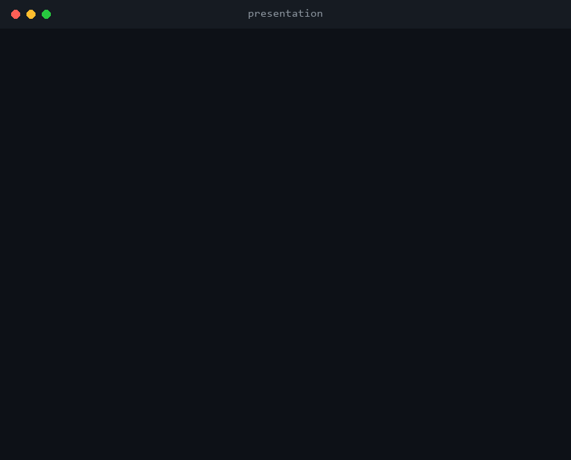
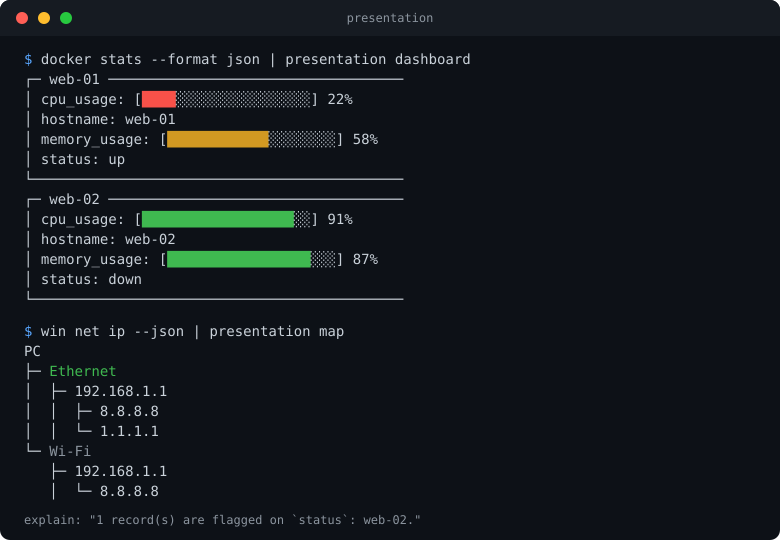

# presentation

[](https://github.com/rjreeves/CLI-Presentation/actions/workflows/ci.yml)

A universal renderer for structured CLI output. Pipe JSON from any command into `presentation` and get a table, dashboard, chart, timeline, topology diagram, HTML/Markdown report, or a plain-English summary — instead of raw JSON.

```
docker stats --format json | presentation dashboard
kubectl get pods -o json   | presentation table
myapp --json                | presentation
```

That last one has no mode at all: if the payload carries a `schema` field, `presentation` picks a sensible renderer for you.

## Demo



<details>
<summary>Static version</summary>



</details>

## Why

Structured CLI output (`--json` flags, `kubectl -o json`, log tools, metrics agents) is easy to produce and unpleasant to read. `presentation` is a single, tool-agnostic sink: any producer that emits the [Presentation Protocol](docs/presentation-protocol.md) (really just `{"data": [...]}`) gets tables, dashboards, charts, timelines, topology maps, and reports for free.

Full design background lives in [`docs/`](docs) — this README is the practical quick start.

## Install / build

Requires a recent Rust toolchain (`rustup` is easiest).

```bash
git clone https://github.com/rjreeves/CLI-Presentation.git
cd CLI-Presentation
cargo build --release
./target/release/presentation --help
```

## Quick start

```bash
echo '{"data":[{"interface":"Ethernet","ipv4":"192.168.1.10","status":"Up"}]}' | presentation table
```

```
interface | ipv4         | status
---------------------------------
Ethernet  | 192.168.1.10 | Up
```

## Modes

| Mode | What it shows |
|---|---|
| `table` | Sortable, color-coded rows |
| `dashboard` | Boxed panels with gauge bars for numeric fields (cpu/memory/signal/...) |
| `chart` | Bar, line (sparkline), or pie — `--chart-type bar\|line\|pie` |
| `timeline` | Chronological event list, sorted by timestamp automatically |
| `map` | ASCII topology tree (interface → gateway → DNS) |
| `html` | Self-contained HTML report |
| `md` | Markdown report |
| `explain` | Plain-English observations about the data — `--explain-level brief\|detailed` |
| `ai-summary` | One condensed sentence — same `--explain-level` flag |

`explain`/`ai-summary` are deterministic and rule-based, not an LLM call — see [Scope decisions](docs/scope-decisions.md) for why.

Mode is optional — omit it and `presentation` infers a mode from the payload's `schema` field (falling back to `table`):

```bash
echo '{"schema":"docker.stats","data":[...]}' | presentation
```

## Options

```
--sort <field>              Sort rows by this field
--filter <field=value>      Keep only matching rows
--width <cols>              Terminal width for layout
--output <file>             Write to a file instead of stdout
--export <html|md|svg|pdf>  Wrap any mode's output in another format (pdf: not implemented, errors clearly)
--live                      Redraw on each newline-delimited payload on stdin (dashboard/timeline only)
```

## Schema registry

Third parties can register their own schema → renderer mapping, stored in `~/.presentation/registry.json`:

```bash
presentation register --schema myapp.metrics --renderer chart --fields fields.json
echo '{"schema":"myapp.metrics","data":[...]}' | presentation   # now auto-selects chart

echo '{"schema":"myapp.metrics","data":[...]}' | presentation validate   # check payload against the registry
```

See [`docs/schema-registry.md`](docs/schema-registry.md) for the full field-definition format.

## Development

```bash
cargo test              # 94 unit tests + 34 end-to-end CLI tests
cargo fmt -- --check
cargo clippy --all-targets -- -D warnings
```

CI runs all three on every push.

## Docs

- [`docs/presentation-command.md`](docs/presentation-command.md) — CLI spec
- [`docs/presentation-protocol.md`](docs/presentation-protocol.md) — the `{"data": [...]}` data contract
- [`docs/schema-registry.md`](docs/schema-registry.md) — schema → renderer registry format
- [`docs/renderer-architecture.md`](docs/renderer-architecture.md) — internal renderer design
- [`docs/scope-decisions.md`](docs/scope-decisions.md) — where this implementation deliberately diverges from or narrows the specs above, and why
- [`CHANGELOG.md`](CHANGELOG.md) — release history

## License

[MIT](LICENSE)
